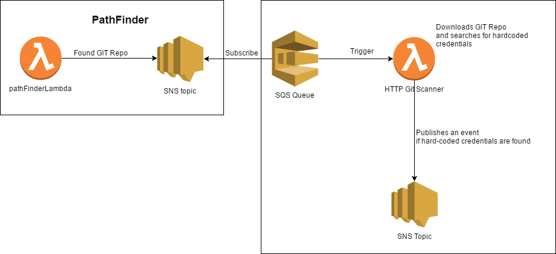

# Notice

The work on this project is still ongoing. Don't bother taking that into use until it's properly finished.

# About

The project contains an AWS lambda that can be triggered by an SNS event from the pathFinderLambda: https://github.com/kamiljano/pathFinderLambda .

More specifically, once the path finder lambda generates a notification that a GIT repository has been detected,
this lambda attempts to download that repository in search of any credentials. Note however that the .git
directory contains files with random names that cannot be pre-configured. This is why simply finding that
a git repository is there may be not sufficient. It has to be available on an HTTP server that allows
you to browse the directories (such as apache server). This means that this will not work for instance with cloud buckets.

# Local execution

    serverless invoke local --function handle --path events/detectedGit.json --tempDir <somePathOnYourDriveForTemporaryFiles>